# Closure

A research program on inference-time structure in large language models: a testable mechanistic hypothesis for hallucination and confidence, non-LLM-judged verification of model outputs, and a test of whether structural output quality is one measurable object.

## Problem

Production evaluation of LLM outputs is LLM-as-judge — a model grading a model, inheriting its failure modes. The causal alternatives are published and validated (leave-one-out attribution, perturbation testing, semantic clustering) but ship nowhere together, and nobody has asked whether the properties they measure are related. Meanwhile the 2025–26 literature on hidden-state dynamics contradicts itself: hallucination is reported both as a trajectory settling *too early* into a stable-but-wrong attractor (arXiv:2604.15400) and as *failing to settle* (arXiv:2602.09825, 2507.06722) — and no study measures the variable that could reconcile them: whether the state settled **before or after incorporating the provided evidence**.

## The measurement, on one example

*The numbers below are illustrative — no experiment has run yet ([`/results`](results/)).*

A RAG model is asked *"What did the 2023 audit find regarding vendor payments?"*, with the audit report as source **[A]**. It answers:

> 1. The audit identified $2.1M in duplicate vendor payments **[A]**.
> 2. Duplicate payments of this kind typically indicate missing three-way-match controls **[A]**.

The citations are typographically identical. An LLM judge grades both "supported" — both are *consistent* with the source. Consistency cannot distinguish **derived from** and **merely compatible with**.

Intervene instead: remove [A], regenerate three times, compare claims by NLI entailment. Claim 1 disappears — grounding score **G ≈ 0.9**, causally grounded. Claim 2 persists verbatim — **G ≈ 0.1**: the source is not why the model said it (decorative citation or trained-in knowledge; the test reports that ambiguity rather than hiding it).

The same intervention logic gives **R**, rigidity (rephrase the input five ways: which conclusions survive?) and **P**, ambiguity preservation (generate ten times: how many semantically distinct answers does the model hold?). Every test replaces an opinion with an intervention.

RAG is the teaching case, not the scope. The identical intervention runs wherever a model was given inputs and produced an output: remove the requirement from the spec — does the generated code change, or was it going to write that anyway? Remove the tool result from the agent's context — does its action change, or was the lookup decorative? Remove the lab values — does the clinical suggestion change? **Given-inputs → output is the unit of verification; the domain is irrelevant.**

## The hypothesis

Define **closure**: the terminal state of inference-time reorganization — the structures determining the output have stopped changing and are mutually consistent with the given constraints. **[H-CORE](HYPOTHESES.md#h-core--closure-exists):** grounding, rigidity and ambiguity preservation are correlated readouts of closure quality. One latent factor, testable by factor analysis over score matrices (the instrument validated on capability benchmarks in arXiv:2507.20208, never applied to these axes). Pre-registered: a single factor explaining ≥ 60% of shared variance with same-sign loadings, surviving difficulty controls, confirms; pairwise |r| < 0.2 refutes — and the term is retired.

That test is [E0](experiments/E0-closure-existence/). It costs API credits and a statistics notebook, and it gates the program: the specification layers ([E6](experiments/E6-lowering-invariance/), [E7](experiments/E7-composition/)) are only coherent if there is one object to specify over.

## The experiments

<picture>
  <source media="(prefers-color-scheme: dark)" srcset="figures/claim-structure-dark.svg">
  
</picture>

Every branch is falsifiable on its own; E0 decides whether the center is real. Full protocols with pre-registered verdict conditions in [`/experiments`](experiments/) — along with the build-dependency graph for contributors. No timelines; ordering is dependency and cost only.

| ID | Claim under test | Literature state |
|---|---|---|
| [E0](experiments/E0-closure-existence/) | G/R/P collapse to one latent factor | Instrument validated; this application unrun; nearest candidate withdrawn by its authors |
| [E1](experiments/E1-premature-closure/) | Hallucination = settling before evidence incorporation | Direction contested across published papers; the coupling unmeasured |
| [E2](experiments/E2-conserved-quantities/) | The forward pass has conservation laws; violations predict failure | No prior work on either half |
| [E3](experiments/E3-future-volume/) | Future-output diversity is continuous and linearly decodable pre-sampling | Binarized probe exists; continuous target, confidence baseline, belief-state link do not |
| [E4](experiments/E4-enforced-ambiguity/) | Enforced interpretation coverage beats instruction | Enforcement exists (unreviewed, 2-arm); causal isolation unrun |
| [E5](experiments/E5-reclosure/) | Mechanical context rebuild beats instructed disregard | Premise replicated ≥ 7×; the 3-arm comparison unrun |
| [E6](experiments/E6-lowering-invariance/) | Independent enforcement backends agree on one spec's verdicts | Claim never stated in the literature |
| [E7](experiments/E7-composition/) | Composed checks catch what single checks miss | Designed; unrun |

## What each result changes

<picture>
  <source media="(prefers-color-scheme: dark)" srcset="figures/deliverables-dark.svg">
  
</picture>

The verification instrument itself is unconditional — it is built to run the experiments and stands regardless of their outcomes. Where it lands is every setting with the given-inputs → output shape:

| Domain | Given → produced | The question answered by intervention, not opinion |
|---|---|---|
| Code generation | spec + codebase → change | Did the change derive from the requirement — or would the model have written it anyway? |
| Autonomous agents | tool results + constraints → actions | Did the action depend on what the tool returned? Can a retracted assumption actually be retracted? |
| Medical | patient data + history → assessment | Is the conclusion grounded in *this* patient's values, not the textbook prior? |
| Legal | case law + statutes → analysis | Is the cited precedent load-bearing or decorative? |
| Finance & compliance | filings + rules → report | Does every claim carry causal, auditable evidence a reviewer can inspect? |
| Research / RAG | sources + question → cited answer | Which citations are causal and which are decorative? |
| Content | brand guidelines + brief → copy | Did it follow the brief, or generate the generic default? |

Demand concentrates first where verification is becoming mandatory (EU AI Act high-risk systems, FDA-regulated AI/ML devices) and where unverified output already carries legal cost — but the instrument is domain-blind by construction: the model is a callable, the inputs are whatever you gave it.

Each consequence in the figure above is bought by the named confirmations; refutations close questions the field currently keeps reopening. In detail:

| | Confirmed | Refuted |
|---|---|---|
| **E0** | One object to specify over; the spec layers are principled | Term retired publicly; the tests stay valid; E1/E2/E3/E5 unaffected |
| **E1** | Hallucination is a measurable event with a mechanism — intervene before readout, not after the text | The late-instability account wins; the field's contradiction resolves either way |
| **E2** | The first conservation law of transformer inference | "Native invariants" demoted to metaphor, on the record |
| **E5** | A principled revision operation with quantified effect; context management stops being folklore | Instruction suffices — surprising against seven published failures, publishable as such |
| **E6** | An intermediate representation exists; a compiler-style toolchain is worth building | No IR — the idea dies cheaply, before anyone builds the expensive version |

E3, E4 and E7 carry the same two-sided structure in their protocols. A program whose total-refutation branch still produces value is not a bet on being right; it is a bet on the questions being worth deciding.

## Retired claims, citation status

Claims that failed adversarial review are recorded and closed — "new computational paradigm," "complete operator algebra," "convergent design," closure-as-formalized-mathematics ([HYPOTHESES.md § Retired](HYPOTHESES.md#retired-claims)). Two founding ideas were independently published by others in 2026; priority cannot be publicly established, so they are recorded as convergence, not prediction ([reduction history](background/reduction-history.md)). Every citation carries an explicit verification status, most currently unverified pending a human read of the primary source ([VERIFICATION.md](VERIFICATION.md)) — flipping one row is the smallest complete contribution.

## Documents

- [CONCEPT.md](CONCEPT.md) — the founding vision, preserved as hypothesis
- [HYPOTHESES.md](HYPOTHESES.md) — every claim with its kill condition; retired claims with cause of death
- [METHODOLOGY.md](METHODOLOGY.md) — every method anchored to its named standard, declared as a contribution, or listed as a known nonconformance with its fix
- [decisions/](decisions/) — the methodology choices each experiment's protocol leaves open, frozen with their reasoning (proposed until pre-registered)
- [experiments/E0-closure-existence/PLAN.md](experiments/E0-closure-existence/PLAN.md) — how the shared G/R/P instrument is built and run to a first verdict
- [background/](background/) — prior-art map, closure vs Design-by-Contract, reduction history, how the execution plan was derived
- [CONTRIBUTING.md](CONTRIBUTING.md) — evidence standards, how to run or attack an experiment

MIT license.
