# The Experiment Program

Nine experiments (E0–E7, plus E8 derived post-E5). Each one tests a hypothesis from the [registry](../HYPOTHESES.md), ships with its kill condition, and is decomposed into concrete steps in its own folder. **No timelines, no priority tiers** — the only ordering is dependency and cost.

## Dependency structure

<picture>
  <source media="(prefers-color-scheme: dark)" srcset="../figures/dependencies-dark.svg">
  
</picture>

Solid edges: the measurement tooling consumed as an instrument — one implementation feeds six experiments, which is why building it well is a contribution to every experiment at once. Dashed edges: logical gating — E6b (the expressiveness A/B) runs only if E6 confirms, and its aggregate-score portion additionally assumes a positive E0. Note that E0 does **not** gate E4–E7: it decides scalar aggregation only, and each structural experiment is retired within the property it measures ([governing rule](../HYPOTHESES.md)). E2 and E3 depend on nothing and can start any time.

## Suggested order for a newcomer

1. **[E0](E0-closure-existence/)** — near-free, decides scalar aggregation (H-SCALAR) only, pure statistics on top of scored outputs.
2. **[E5](E5-reclosure/)** — API-only, the premise has a strong published tailwind, a clean result in days.
3. **[E3](E3-future-volume/)** — first experiment needing an open-weights model; standalone-valuable outcome either way.
4. **[E4](E4-enforced-ambiguity/)** — the first actuation test (enforcement vs instruction).
5. **[E1](E1-premature-closure/)** — mechanistic; adjudicates a live contradiction in the literature.
6. **[E6](E6-lowering-invariance/)** — needs two independent backend implementations.
7. **[E7](E7-composition/)** — interpret in light of E0's answer.
8. **[E2](E2-conserved-quantities/)** — highest risk, flagship if positive.

## Run discipline (applies to every experiment)

Adopted from the preregistration standard for AI-agent experiments (arXiv:2606.11217) and classical preregistration requirements — see [METHODOLOGY.md](../METHODOLOGY.md):

1. **Exact model identity.** Checkpoint/version string (`gpt-4-0125-preview`, not "GPT-4"), provider, and date. For open models: weights revision.
2. **Full generation parameters.** Temperature, top-p/top-k, seeds, max tokens — everything needed to re-run.
3. **Verbatim prompts.** The exact text, committed with the run — not a description of it.
4. **Pilot-testing disclosure.** How many prompt/design iterations were tried before the registered run, on which models, and whether preliminary results shaped the final hypothesis or thresholds.
5. **Exclusion criteria declared before running.** Each experiment's README states what gets excluded and under what rule; exclusion counts are reported with the results. No post-hoc exclusions based on outcome values.
6. **Confirmatory vs exploratory.** Anything not specified in the protocol before the run is reported as exploratory, labeled as such.
7. **Sample-size rationale.** Where a choice (K regenerations, N tasks) is cost-bounded rather than power-derived, the run says so explicitly.

## Reporting standard

Results land in [`/results`](../results/) — one folder per experiment run, containing: the exact protocol version used, raw artifacts (scores, trajectories, transcripts), analysis code, and a verdict written against the pre-registered confirm/refute conditions. Deviations from protocol are reported, not silently absorbed. Negative results get the same treatment as positive ones.
